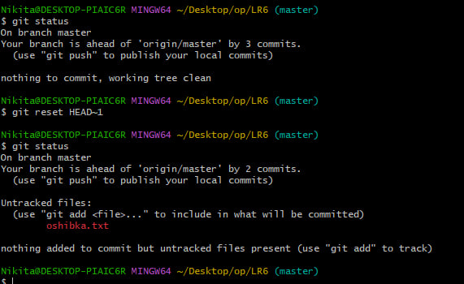

# Лабораторная работа №6

## Цель лабораторной работы
Изучение базовых возможностей системы управления версиями, освоение работы с Git API, а также практическая работа с локальными и удалёнными репозиториями.

---

## Ход выполнения

### 1. Настройка клиента Git
Настроен клиент Git для работы с репозиториями.  
Скриншот:  


**Рисунок 1** — Настройка клиента Git.

---

### 2. Клонирование личного репозитория
Был выполнен процесс клонирования личного удалённого репозитория на локальный компьютер.  
Скриншот:  


**Рисунок 2** — Клонированный репозиторий.

---

### 3. Добавление файла через интерфейс GitHub
В интерфейсе GitHub был добавлен новый файл в репозиторий.  
Скриншот:  


**Рисунок 3** — Добавление файла через GitHub.

---

### 4. Подтягивание изменений в локальный репозиторий
После добавления файла изменения были подтянуты в локальный репозиторий.  
Скриншот:  


**Рисунок 4** — Подтягивание изменений.

---

### 5. История операций каждой из веток
Была получена история операций для каждой из веток в репозитории.  
Скриншот:  


**Рисунок 5** — История операций.

---

### 6. Просмотр последних изменений
Выполнен просмотр последних изменений в проекте.  
Скриншот:  


**Рисунок 6** — Просмотр последних изменений.

---

### 7. Слияние в ветку master
Начало слияния в ветку master. Наличие конфликта.  
Скриншот:  


**Рисунок 7** — Конфликт при слиянии.

---

### 8. Удалена побочная ветка локально
На рисунке 8 — Скриншот решения конфликта при merge.  


**Рисунок 8** — Решение конфликта при merge
---

### 9. Решение конфликта при merge
На рисунке 9 — Результат успешного решения конфликта  


**Рисунок 9** — Результат успешного решения конфликта
---

### 10. Удалена побочная ветка локально
На рисунке 10 — локальное удаление побочной ветки  


**Рисунок 10** — Локальное удаление побочной ветки
---

### 11. Удалена побочная ветка глобально
На рисунке 11 — глобальное удаление побочной ветки  


**Рисунок 11** — Глобальное удаление побочной ветки

---

### 12. Фиксация нескольких изменений.
На рисунке 12 — создание и добавление нескольких коммитов.  


**Рисунок 12** — Создание и добавление нескольких коммитов

---

### 13. Откат коммита   
На рисунке 13 — откат коммита  


**Рисунок 13** — Откат коммита

---

### 14. Создание ветки отчёта
На рисунке 14 — создание ветки для отчёта  


**Рисунок 14** — Создание ветки для отчёта

---

### 15. История операций в форматированном виде. 
На рисунке 15 — История операций.  


**Рисунок 15** — История операций.


Лог команд:
```
git config --global user.email "nicitadar@mail.ru"
git config --global user.name "4319 Darmanyan Nikita Pavlovich"

git clone https://github.com/NikitaChelovek/LR6
git pull
git log --all
git lop -p -1

git branch
git merge branch1

git status
git status
git branch -d "branch1"
git push origin --delete branch1

ls
git status
git add main.cpp
git commit -m "добавлен main.cpp"

git add main.py
git commit -m "добавлен main.py"

git add oshibka.txt
git commit -m "добавлено oshibka.txt"

git status

git reset HEAD~1

git status
git checkout -b otchet
git log --pretty

git status
git add *
git commit -m "созданы первые части отчёта, добавлены img"
git status
git add *
git commit -m "Вторая версия отчёта"
git status
git add *
git commit -m "Третья версия отчёта"

```